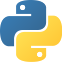

### Hi there, I'm Arthur. 
Nice to meet you! 👋

<!--
#### 🔭 I’m currently working on ...

+ APPs
    + 一起聽歌
    + AI星爆氣流斬合成器
    + 簡單記帳
    + 簡單投票
+ Pygame
    + 小恐龍對戰
+ and so on... -->

🌱 I’m currently learning : Golang 、Python 、Flutter 

⚡ Some Info : 

<!--
**Tora0615/Tora0615** is a ✨ _special_ ✨ repository because its `README.md` (this file) appears on your GitHub profile.

Here are some ideas to get you started:

- 🔭 I’m currently working on ...
- 🌱 I’m currently learning ...
- 👯 I’m looking to collaborate on ...
- 🤔 I’m looking for help with ...
- 💬 Ask me about ...
- 📫 How to reach me: ...
- 😄 Pronouns: ...
- ⚡ Fun fact: ...
-->
