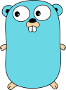

## Hi there, I'm Arthur.
I am a student who love road trip by motorcycle.

And I am also interest in camping, hiking and take photos.

Nice to meet you here. 👋

 
 

If you need to contact to me, please send an email to this address : akikawatora@gmail.com

<!--
#### 🔭 I’m currently working on ...

+ APPs
    + 一起聽歌
    + AI星爆氣流斬合成器
    + 簡單記帳
    + 簡單投票
+ Pygame
    + 小恐龍對戰
+ and so on... -->

### 🌱&nbsp;&nbsp;Skill Tree :

#### Languages
* C : data structure
* Python : web crawler
* Dart : flutter app
* Java : Algorithm
* Go : basic

#### App Framework
Flutter ( Cross Platform App Framework)
#### Tools
Git ( CLI & Source Tree )
#### OS
Windows, MacOS, Linux ( Ubuntu GUI & CLI )
#### IOT
Arduino hardware and software.

### 🤔&nbsp;&nbsp;Currently learning :

#### Languages

* advanced : Go, Flutter
* basic : Swift

#### Others
* How to maintain a server on a small RPi 3

<!-- 

 -->

### ⚡ Some Info :

 <html>&nbsp;&nbsp;</html> 

<!--

-->

### 💬 Small talk
Current spend too much time on playing Genshin Impact.

RIP my codes.

<!--
**Tora0615/Tora0615** is a ✨ _special_ ✨ repository because its `README.md` (this file) appears on your GitHub profile.

Here are some ideas to get you started:

- 🔭 I’m currently working on ...
- 🌱 I’m currently learning ...
- 👯 I’m looking to collaborate on ...
- 🤔 I’m looking for help with ...
- 💬 Ask me about ...
- 📫 How to reach me: ...
- 😄 Pronouns: ...
- ⚡ Fun fact: ...
-->
